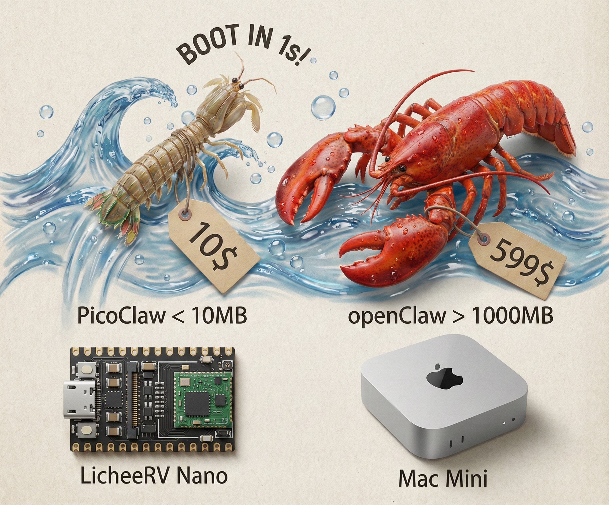
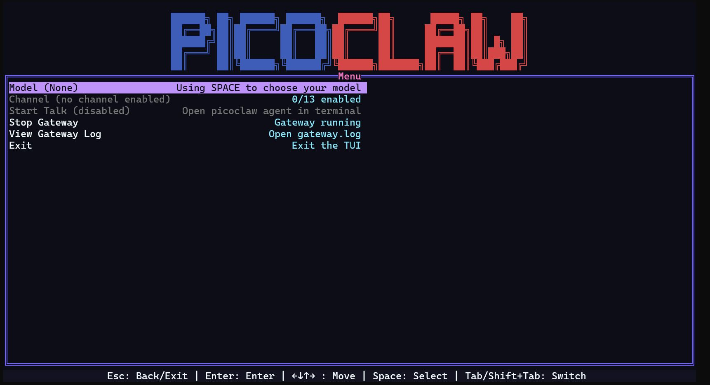
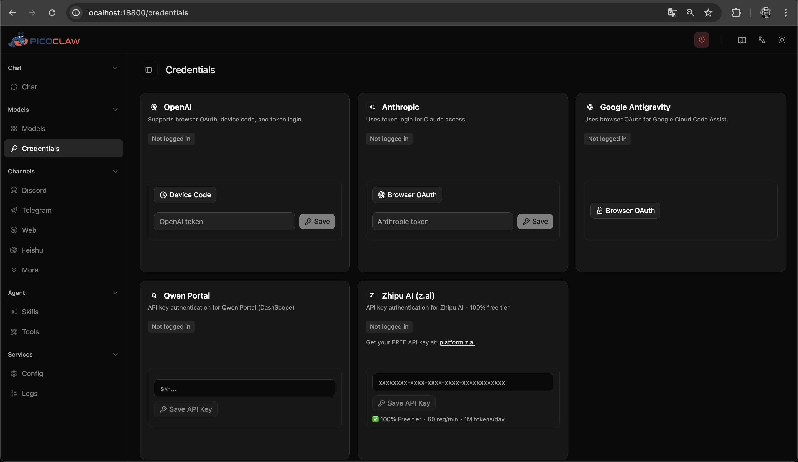
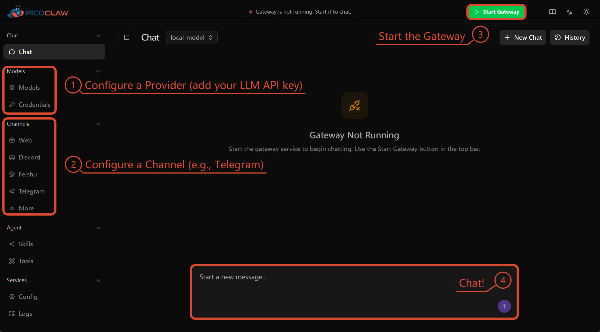

<div align="center">
  

  <h1>PicoClaw-Agents</h1>
  <h3>🤖 Arquitectura Multi-Agente 🚀 Subagentes en Paralelo</h3>

[English](README.md) | [中文](README.zh.md) | [Français](README.fr.md) | [日本語](README.ja.md) | **Español**

> **Nota:** Este proyecto es un fork independiente y de aficionado del [PicoClaw](https://github.com/sipeed/picoclaw) original creado por **Sipeed**. Se mantiene con fines experimentales y educativos. Todo el crédito por la arquitectura base original pertenece al equipo de Sipeed.

| Característica         | OpenClaw      | NanoBot                | PicoClaw                        | PicoClaw-Agents |
| :--------------------- | :------------ | :--------------------- | :------------------------------ | :-------------- |
| Lenguaje               | TypeScript    | Python                 | Go                              | Go              |
| RAM                    | >1GB          | >100MB                 | < 10MB                          | < 45MB          |
| Arranque (core 0.8GHz) | >500s         | >30s                   | <1s                             | <1s             |
| Costo                  | Mac Mini 599$ | Mayoría Linux SBC ~$50 | Cualquier placa Linux Desde $10 | Cualquier Linux |

## 🤝 Apoya Este Proyecto

Este proyecto se desarrolla y mantiene con la ayuda de herramientas de IA. Todos los cambios de código en este repositorio se implementaron usando **Qwen Code**, que también ofrece un generoso plan gratuito.

**🌟 Qwen Code (Alibaba Cloud)** — Asistente de codificación con IA con plan gratuito.

```bash
./picoclaw-agents auth login --provider qwen
# Ver modelos: http://localhost:18800/models
```

👉 [Comenzar](https://www.alibabacloud.com/campaign/benefits?referral_code=A924LX)

**🌟 Zhipu AI (z.ai)** — 100% GRATIS con `glm-4.5-flash`

```bash
./picoclaw-agents auth login --provider zhipu
```

🚀 Te han invitado a unirte al GLM Coding Plan. Soporte completo para Claude Code, Cline y más de 20 herramientas de codificación — desde solo $10/mes.
👉 [Únete ahora](https://z.ai/subscribe?ic=RF2YMCHBHL)

> 💡 Usar estos enlaces ayuda a apoyar el desarrollo continuo de PicoClaw-Agents. ¡Gracias!

## ✨ Características

*   🪶 **Ultra-Ligero**: Implementación en Go optimizada con un consumo mínimo.
*   🤖 **Arquitectura Multi-Agente**: Seguridad Fail-Close (detecta config inválida), manejo robusto de cierre de canales/bus, y Sentinel de Skills (capa de seguridad nativa) con sanitización de entrada/salida y auditoría local (`AUDIT.md`).
*   🚀 **Subagentes en Paralelo**: Crea múltiples subagentes autónomos trabajando en paralelo, cada uno con configuraciones de modelo independientes.
*   🌍 **Portabilidad Real**: Único binario autocontenido para arquitecturas RISC-V, ARM y x86.
*   🦾 **Bootstrapped por IA**: Implementación core refinada mediante flujos de trabajo autónomos de agentes.
*   📈 **Integración con Binance**: Herramientas nativas de trading para balances spot, posiciones en futuros (LONG/SHORT), y datos públicos de ticker vía API directa o servidor MCP.
*   📱 **Herramientas de Redes Sociales**: Publica en Facebook (imágenes + mensajes) y X/Twitter (tweets + hilos) con soporte multi-página y fallback automático de comentarios.
*   🎨 **Generación de Imágenes con IA**: Genera imágenes desde prompts de texto usando Gemini o Ideogram. Incluye flujo script-a-imagen y publicación automática en redes sociales.
*   📝 **Integración con Notion**: Crea, consulta y actualiza páginas y bases de datos para gestión de tareas y conocimiento.
*   🤖 **Community Manager**: Genera automáticamente publicaciones atractivas para redes sociales desde contenido técnico o imágenes generadas.
*   ⚡ **Slash Commands de "Fast-path"**: Comandos de sistema instantáneos vía `/` o `#` que saltan el LLM para aprobaciones, chequeos de estado y gestión de lotes (bundles) sin latencia. Funciona en Telegram, Discord y CLI (Terminal).
*   🖇️ **Sincronización de Estado Global**: Global ImageGenTracker, un espacio de memoria compartido entre todos los agentes (PM y Subagentes) para asegurar una consistencia perfecta en flujos multi-agente.
*   🚀 **Arquitectura de Skills Nativas**: Skills nativas compiladas directamente en el binario (`pkg/skills/queue_batch.go`), eliminando dependencias de archivos externos y mejorando la seguridad. Ver [docs/QUEUE_BATCH.es.md](docs/QUEUE_BATCH.es.md).

## 📢 Noticias

2026-03-31 🎉 **Integración del Fork ICUETH**: Análisis completo del fork icueth completado. Comparación de arquitectura: A2A horizontal (109 agentes) vs subagentes paralelos. Características identificadas: Sistema de Reuniones de Agentes, Sistema de Personas, memoria RAG/SQLite, soporte MCP, sistema Mailbox. Estrategia de integración definida en 3 fases. Auditoría completada: ✅ CLEAN. Ver [CHANGELOG.md](CHANGELOG.md).

2026-03-31 🎉 **Auth WebUI de Qwen y Zhipu**: Añadida autenticación de Qwen Portal y Zhipu AI vía WebUI en `http://localhost:18800/credentials`. Comandos CLI: `./picoclaw-agents auth login --provider qwen` y `--provider zhipu`. Auto-configura modelos tras autenticación. Zhipu glm-4.5-flash es 100% GRATIS. Ver [CHANGELOG.md](CHANGELOG.md).

2026-03-28 🎉 **Migración Multi-Origen + Team Mode en Onboard**: Añadido `picoclaw-agents migrate --from nanoclaw` para migrar configs desde NanoClaw. El wizard de onboard ahora incluye **Team Mode** con plantillas predefinidas (Dev Team 9 agentes, Research Team 3 agentes, General Team 3 agentes) y selección de **14 skills nativas**. Mejoras en Context Window: pruning de tool results (-60% tokens), compactación avanzada con override de modelo, y comando manual `/compact`. Ver [CHANGELOG.md](CHANGELOG.md).

2026-03-27 🎉 **Calidad de build y mejoras de canales**: `go build ./...` ahora pasa limpiamente. Añadida API de group trigger a `BaseChannel`: `WithGroupTrigger`, `IsAllowedSender` y `ShouldRespondInGroup` — control granular de chats de grupo (solo menciones, triggers por prefijo). Ver [CHANGELOG.md](CHANGELOG.md).

2026-03-27 🎉 **WebUI Launcher completamente operativo**: `picoclaw-agents-launcher` funciona de extremo a extremo — botón Start Gateway, chat WebSocket vía PicoChannel, contenido de skills nativas en la página de Skills, y todas las secciones del menú validadas. Ejecuta con `picoclaw-agents-launcher` o `picoclaw-agents-launcher -public` para acceso desde la red.

2026-03-27 🎉 **Pipeline de release con 3 binarios**: GoReleaser ahora produce los tres binarios — `picoclaw-agents` (CLI), `picoclaw-agents-launcher` (WebUI) y `picoclaw-agents-launcher-tui` (TUI) — igualando la estructura de releases del proyecto original. Lanzar con `./scripts/create-release.sh`.

2026-03-26 🎉 **Documentación de MCP Builder**: Documentación completa de MCP Builder Agent en inglés y español con referencia de API, casos de uso y ejemplos. Ver [docs/MCP_BUILDER_AGENT.md](docs/MCP_BUILDER_AGENT.md) y [docs/MCP_BUILDER_AGENT.es.md](docs/MCP_BUILDER_AGENT.es.md).

2026-03-26 🎉 **Comandos Sandbox y Codegen**: Añadidos `sandbox init/status` para workspaces aislados y `util codegen` para generación de código Go. Ver [CHANGELOG.md](CHANGELOG.md).

2026-03-26 🎉 **Monitor de Tokens Auth**: Añadidos comandos `auth tokens` y `auth monitor` para seguimiento de expiración de tokens OAuth. Ver [CHANGELOG.md](CHANGELOG.md).

2026-03-26 🎉 **Validador de Config y Secret Masking**: Añadido comando `config validate` para validación de schema y enmascarado de secretos en el wizard de onboard. Ver [CHANGELOG.md](CHANGELOG.md).

2026-03-26 🎉 **Comando Doctor**: Añadido comando `doctor` para diagnóstico de entorno incluyendo detección de WSL y verificaciones de seguridad. Ver [CHANGELOG.md](CHANGELOG.md).

2026-03-12 🎉 **Soporte Antigravity y Estabilidad**: Soporte completo de Google Antigravity OAuth con saneamiento de schema, corrección de deadlock TokenBudget, mejoras de rehidratación de sesión, nuevo comando `picoclaw-agents clean`, y patrones de denegación reforzados. Ver [CHANGELOG.md](CHANGELOG.md) para más detalles.

2026-03-03 🎉 **Arquitectura de Skills Nativas**: Introducidas skills nativas compiladas directamente en el binario (`pkg/skills/queue_batch.go`), eliminando dependencias de archivos `.md` externos. Seguridad, rendimiento y type safety mejorados. Ver [docs/QUEUE_BATCH.es.md](docs/QUEUE_BATCH.es.md).

2026-03-02 🎉 **Fast-path y Global Tracker**: Añadidos comandos Slash instantáneos (`/bundle_approve`, `/status`, etc.) para interacción sin latencia. Unificado el `ImageGenTracker` en todos los agentes para consistencia total de estado. Consulta [docs/queue_batch.md](docs/queue_batch.md).

2026-03-01 🎉 **Generación de Imágenes con IA y Community Manager**: Añadida generación nativa de imágenes (Gemini/Ideogram), flujos de script-a-imagen, menús interactivos post-generación, y agente community manager para generar automáticamente publicaciones en redes sociales. Consulta [docs/IMAGE_GEN_util.es.md](docs/IMAGE_GEN_util.es.md) para configuración completa y ejemplos de uso.

2026-03-01 🎉 **Integraciones Externas (Binance, Redes Sociales, Notion)**: Añadidas herramientas nativas para trading de criptomonedas (futuros y spot de Binance), publicación en redes sociales (Facebook y X/Twitter), y gestión de conocimiento (Notion). Configura vía `config.json` o variables de entorno. Consulta [SOCIAL_MEDIA.es.md](SOCIAL_MEDIA.es.md) y [docs/NOTION_util.es.md](docs/NOTION_util.es.md) para guías de configuración.

2026-03-01 🎉 **Sentinel de Skills Nativo**: Añadida una capa de seguridad interna (`skills_sentinel.go`) que proporciona protección en tiempo real contra inyecciones de prompts y filtraciones del sistema.
2026-03-01 🎉 **Refuerzo de Seguridad y Estabilidad**: Manejo robusto del cierre del bus de mensajes, procesamiento en segundo plano resiliente para la App de WeCom y validación de inicialización reforzada para la herramienta de consola.
2026-03-01 🎉 **Seguridad Fail-Close**: Política de seguridad robusta. La herramienta de ejecución de comandos ahora realiza una validación estricta de los patrones de denegación durante la inicialización.

2026-02-27 🎉 **Recuperación ante Desastres y Task Locks**: Se han implementado Task Locks atómicos para prevenir colisiones entre agentes, "Boot Rehydration" para recuperarse de caídas abruptas, y un Compactador de Contexto (que eleva el límite a 32K tokens de forma segura) para erradicar las explosiones de contexto en tareas de código largas.




## 🦾 Demostración

### 🛠️ Flujos de Trabajo de Asistente Estándar

<table align="center">
  <tr align="center">
    <th><p align="center">🧩 Ingeniero Full-Stack</p></th>
    <th><p align="center">🗂️ Gestión de Logs y Planificación</p></th>
    <th><p align="center">🔎 Búsqueda Web y Aprendizaje</p></th>
    <th><p align="center">🔧 Trabajador General</p></th>
  </tr>
  <tr>
    <td align="center"></td>
    <td align="center"></td>
    <td align="center"></td>
    <td align="center"></td>
  </tr>
  <tr>
    <td align="center">Desarrollar • Desplegar • Escalar</td>
    <td align="center">Programar • Automatizar • Memoria</td>
    <td align="center">Descubrimiento • Insights • Tendencias</td>
    <td align="center">Tareas • Soporte • Eficiencia</td>
  </tr>
</table>

### 🚀 Flujo Multi-Agente Avanzado (El "Dream Team")

Aprovecha la arquitectura de subagentes para desplegar un equipo completo para el ciclo de vida de desarrollo de software.

**El equipo "DevOps & QA" (Potenciado por [DeepSeek Reasoner](https://platform.deepseek.com)):**

*   **`project_manager` (Líder)**: Tiene permiso para crear cualquier agente. Supervisa el objetivo global y delega subtareas.
*   **`senior_dev` (El Motor)**: Experto técnico. Crea al Especialista en QA para revisar código o al Junior Fixer para tareas rutinarias.
*   **`qa_specialist` (Ops & Pruebas)**: Lógica de calidad. Prueba el código, encuentra errores, propone arreglos y gestiona despliegues en GitHub.
*   **`junior_fixer` (El Asistente)**: Se enfoca en pequeños arreglos, refactorización y documentación bajo supervisión.
*   **`general_worker` (La Base)**: Agente versátil para tareas comunes, recuperación de información y soporte para el resto del equipo.

**¿Cómo usar esto?**
Simplemente envía una orden de alto nivel al Líder vía Telegram o CLI:
> *"Líder, necesito que el Senior Dev arregle el error de la base de datos y que el especialista en QA verifique la compilación antes de subirla a GitHub."*

PicoClaw gestionará automáticamente la jerarquía: **PM ➔ Senior Dev ➔ Especialista QA (Fix & Publish).**

> [!TIP]
> **Echa un vistazo a los ejemplos:** Mira `config_dev.example.json` para un equipo estándar de DeepSeek, `config_dev_multiple_models.example.json` para un equipo con modelos mixtos (OpenAI, Anthropic y DeepSeek), y `config_context_management.example.json` para optimizar el uso de tokens en sesiones de código extensas.

---

### 🛠️ MCP Builder Agent - Construye Herramientas de IA Personalizadas

**MCP Builder Agent** (`specialized-mcp-builder`) es un skill especializado en construir servidores del **Model Context Protocol (MCP)**. Crea herramientas personalizadas que extienden las capacidades de tu agente de IA: desde integraciones con APIs hasta acceso a bases de datos y automatización de flujos de trabajo.

#### ¿Qué Puedes Construir?

- 🔌 **Integraciones con APIs**: Conecta con Stripe, GitHub, Slack o cualquier API REST
- 🗄️ **Acceso a Bases de Datos**: Expón datos de forma segura desde PostgreSQL, MySQL, MongoDB
- 📁 **Operaciones de Archivos**: Acceso controlado de lectura/escritura a sistemas de archivos
- 🔄 **Automatización de Flujos**: Automatiza procesos de negocio (facturas, órdenes, notificaciones)
- 🎯 **Herramientas Personalizadas**: ¡Cualquier herramienta que tu imaginación pueda diseñar!

#### Ejemplo Rápido: Servidor MCP para GitHub

**1. Invocar MCP Builder:**

```bash
picoclaw-agents agent -m "Construye un servidor MCP para GitHub API con herramientas para: buscar repos, obtener commits, crear issues"
```

**2. Código Generado:**

```typescript
// github-server.ts
import { McpServer } from "@modelcontextprotocol/sdk/server/mcp.js";
import { StdioServerTransport } from "@modelcontextprotocol/sdk/server/stdio.js";
import { z } from "zod";
import { Octokit } from "octokit";

const server = new McpServer({ name: "github-server", version: "1.0.0" });
const octokit = new Octokit({ auth: process.env.GITHUB_TOKEN });

server.tool(
  "search_repositories",
  { 
    query: z.string().describe("Término de búsqueda"),
    per_page: z.number().default(10)
  },
  async ({ query, per_page }) => {
    const { data } = await octokit.request('GET /search/repositories', {
      q: query,
      per_page: Math.min(per_page, 100)
    });
    
    return { 
      content: [{ 
        type: "text", 
        text: JSON.stringify(data.items.map(repo => ({
          name: repo.full_name,
          stars: repo.stargazers_count,
          url: repo.html_url
        })), null, 2) 
      }] 
    };
  }
);

const transport = new StdioServerTransport();
await server.connect(transport);
```

**3. Configurar en PicoClaw:**

```json
{
  "tools": {
    "mcp": {
      "github": {
        "command": "node",
        "args": ["/path/to/github-server.ts"],
        "env": {
          "GITHUB_TOKEN": "ghp_..."
        }
      }
    }
  }
}
```

**4. Usar con tu Agente:**

```
@agent Busca repositorios de machine learning con más de 1000 estrellas
```

**Resultado:**
```
Encontrados 15 repositorios:
- tensorflow/tensorflow (178k estrellas)
- pytorch/pytorch (85k estrellas)
- scikit-learn/scikit-learn (58k estrellas)
...
```

#### Mejores Prácticas

✅ **HACER:**
- Usar nombres descriptivos: `search_users_by_email` no `query1`
- Validar todos los inputs con schemas Zod
- Proporcionar descripciones detalladas de parámetros
- Manejar errores gracefulmente con mensajes accionables
- Escribir unit tests para cada herramienta

❌ **NO HACER:**
- Usar nombres genéricos como `tool1`, `do_stuff`
- Omitir validación de inputs
- Retornar mensajes de error crípticos
- Depender de estado entre llamadas (mantener herramientas stateless)

#### Documentación

📖 **Guía Completa:** Consulta [docs/MCP_BUILDER_AGENT.es.md](docs/MCP_BUILDER_AGENT.es.md) para:
- Referencia completa de API
- Ejemplos paso a paso (GitHub, PostgreSQL, Stripe)
- Mejores prácticas y patrones
- Estrategias de testing

#### Skills Disponibles

MCP Builder es uno de los **158+ skills especializados** disponibles en PicoClaw:

- **Specialized**: `mcp-builder`, `salesforce-architect`, `blockchain-security-auditor`
- **Engineering**: `backend-architect`, `devops-automator`, `security-engineer`
- **Marketing**: `seo-specialist`, `social-media-strategist`, `content-creator`
- **Support**: `legal-compliance-checker`, `finance-tracker`, `infrastructure-maintainer`

Ver lista completa en [CHANGELOG.md](CHANGELOG.md#370---2026-03-26).


### 📱 Ejecución en teléfonos Android antiguos

¡Dale una segunda vida a tu teléfono de hace diez años! Conviértelo en un Asistente de IA inteligente con PicoClaw. Inicio rápido:

1. **Instala Termux** (Disponible en F-Droid o Google Play).
2. **Ejecuta los comandos**

```bash
# Nota: Reemplaza v0.1.1 con la última versión de la página de Releases
wget https://github.com/comgunner/picoclaw-agents/releases/download/v0.1.1/picoclaw-agents_Linux_arm64
chmod +x picoclaw-agents_Linux_arm64
pkg install proot
termux-chroot ./picoclaw-agents_Linux_arm64 onboard
```

¡Y luego sigue las instrucciones de la sección "Inicio Rápido" para completar la configuración!


### 🐜 Despliegue Innovador de Bajo Perfil

PicoClaw se puede desplegar en casi cualquier dispositivo Linux, desde simples placas embebidas hasta potentes servidores.


## 🚀 Launchers

PicoClaw-Agents incluye dos launchers gráficos opcionales para usuarios que prefieren una interfaz visual.


### 💻 TUI Launcher (Recomendado para Headless / SSH)

El TUI (Terminal UI) Launcher ofrece una interfaz de terminal completa para configuración
y gestión. Ideal para servidores, Raspberry Pi y entornos sin pantalla.

**Compilar:**
```bash
make build-launcher-tui
```

**Ejecutar:**
```bash
picoclaw-agents-launcher-tui
# O en modo desarrollo
make dev-launcher-tui
```

**Características:**
- Menú interactivo de terminal (flechas + teclas rápidas)
- Configuración de modelos de IA
- Gestión de canales (Telegram, Discord, etc.)
- Control del Gateway (iniciar/detener daemon)
- Chat interactivo con IA
- Configuración basada en TOML



---

### 🌐 WebUI Launcher

El WebUI Launcher ofrece una interfaz basada en navegador para configuración y chat.
No se requiere conocimiento de línea de comandos.

**Compilar Frontend:**
```bash
cd web/frontend
pnpm install
pnpm build:backend
# Assets en: web/backend/dist/
```

**Características:**
- Interfaz de configuración basada en navegador
- Gestión visual de canales
- Panel de control del Gateway
- Visor de historial de sesiones
- Gestión de skills
- Configuración de modelos
- Soporte multi-idioma (English, 简体中文，Español)

**Uso:**
```bash
make build-launcher
picoclaw-agents-launcher
# Abre http://localhost:18800 en tu navegador
```

> **Tip — Acceso remoto / Docker / VM**: Agrega el flag `-public` para escuchar en todas las interfaces:
> ```bash
> picoclaw-agents-launcher -public
> ```

**Autenticación OAuth desde Web UI:**

Puedes autenticarte con proveedores OAuth directamente desde la Web UI en `http://localhost:18800/credentials`:

- **Anthropic**: Browser OAuth (flujo PKCE) — Auto-agrega 5 modelos Claude
- **Google Antigravity**: Browser OAuth — Auto-agrega 15 modelos Gemini
- **OpenAI**: Solo Device Code — Auto-agrega 8 modelos GPT
- **Qwen Portal**: API Key (token) — Auto-agrega 6 modelos Qwen
- **Zhipu AI (z.ai)**: API Key (token) — Auto-agrega 7 modelos GLM 🆓 **100% GRATIS** con `glm-4.5-flash`

**Comandos de Autenticación CLI:**

```bash
# OpenAI (Codex OAuth - Device Code)
./picoclaw-agents auth login --provider openai --device-code

# Google Antigravity (OAuth)
./picoclaw-agents auth login --provider google-antigravity

# Qwen Portal (DashScope)
./picoclaw-agents auth login --provider qwen

# Zhipu AI (z.ai) - 100% GRATIS con glm-4.5-flash
./picoclaw-agents auth login --provider zhipu
```

Todos los métodos soportan entrada de token API Key o flujo OAuth y automáticamente configuran los modelos después de una autenticación exitosa.



> **Nota:** OpenAI solo soporta autenticación **Device Code** (no Browser OAuth). Usa el flag `--device-code` o el botón Device Code en la Web UI.




---

## 📦 Instalación

### Instalar con binario precompilado

#### 🍎 macOS (Apple Silicon - M1/M2/M3)

**Descarga e instalación directa:**

```bash
# Descargar última versión
curl -LO https://github.com/comgunner/picoclaw-agents/releases/latest/download/picoclaw-agents_Darwin_arm64.tar.gz

# Extraer
tar -xzf picoclaw-agents_Darwin_arm64.tar.gz

# Hacer ejecutable
chmod +x picoclaw-agents

# Mover al PATH (opcional)
sudo mv picoclaw-agents /usr/local/bin/

# Verificar instalación
picoclaw-agents --version
```

#### 🍎 macOS (Intel - x86_64)

```bash
curl -LO https://github.com/comgunner/picoclaw-agents/releases/latest/download/picoclaw-agents_Darwin_x86_64.tar.gz
tar -xzf picoclaw-agents_Darwin_x86_64.tar.gz
chmod +x picoclaw-agents
sudo mv picoclaw-agents /usr/local/bin/
```

#### 🪟 Windows (x86_64)

**PowerShell (Admin):**

```powershell
# Descargar última versión
Invoke-WebRequest -Uri "https://github.com/comgunner/picoclaw-agents/releases/latest/download/picoclaw-agents_Windows_x86_64.zip" -OutFile "picoclaw-agents.zip"

# Extraer
Expand-Archive -Path "picoclaw-agents.zip" -DestinationPath "$env:USERPROFILE\picoclaw-agents"

# Agregar al PATH (opcional - requiere admin)
$env:Path += ";$env:USERPROFILE\picoclaw-agents"
[Environment]::SetEnvironmentVariable("Path", $env:Path, "User")

# Verificar
picoclaw-agents --version
```

#### 🐧 Linux

```bash
# ARM64 (Raspberry Pi 4, AWS Graviton, etc.)
curl -LO https://github.com/comgunner/picoclaw-agents/releases/latest/download/picoclaw-agents_Linux_arm64.tar.gz
tar -xzf picoclaw-agents_Linux_arm64.tar.gz
chmod +x picoclaw-agents
sudo mv picoclaw-agents /usr/local/bin/

# x86_64 (Intel/AMD)
curl -LO https://github.com/comgunner/picoclaw-agents/releases/latest/download/picoclaw-agents_Linux_x86_64.tar.gz
tar -xzf picoclaw-agents_Linux_x86_64.tar.gz
chmod +x picoclaw-agents
sudo mv picoclaw-agents /usr/local/bin/
```

#### 📦 Todas las Plataformas

Descarga el firmware para tu plataforma desde la [página de releases](https://github.com/comgunner/picoclaw-agents/releases).

| Plataforma | Arquitectura | Archivo |
|------------|--------------|---------|
| macOS | Apple Silicon (M1/M2/M3) | `picoclaw-agents_Darwin_arm64.tar.gz` |
| macOS | Intel (x86_64) | `picoclaw-agents_Darwin_x86_64.tar.gz` |
| Linux | ARM64 | `picoclaw-agents_Linux_arm64.tar.gz` |
| Linux | x86_64 | `picoclaw-agents_Linux_x86_64.tar.gz` |
| Linux | ARMv7 | `picoclaw-agents_Linux_armv7.tar.gz` |
| Windows | x86_64 | `picoclaw-agents_Windows_x86_64.zip` |
| Windows | ARM64 | `picoclaw-agents_Windows_arm64.zip` |

### Instalar desde el código fuente (últimas funciones, recomendado para desarrollo)

```bash
git clone https://github.com/comgunner/picoclaw-agents.git

cd picoclaw-agents
make deps

# Compilar, no es necesario instalar
make build

# Compilar para múltiples plataformas
make build-all

# Compilar e Instalar
make install
```

## 🐳 Docker Compose

También puedes ejecutar PicoClaw usando Docker Compose sin instalar nada localmente.

```bash
# 1. Clona este repositorio
git clone https://github.com/comgunner/picoclaw-agents.git
cd picoclaw-agents

# 2. Configura tus claves API
cp config/config.example.json config/config.json
vim config/config.json      # Configura DISCORD_BOT_TOKEN, claves API, etc.

# 3. Compilar y Arrancar
docker compose --profile gateway up -d

> [!TIP]
> **Usuarios Docker**: Por defecto, el Gateway escucha en `127.0.0.1`, que no es accesible desde el host. Si necesitas acceder a los endpoints de estado o exponer puertos, establece `PICOCLAW_GATEWAY_HOST=0.0.0.0` en tu entorno o actualiza `config.json`.


# 4. Revisar logs
docker compose logs -f picoclaw-gateway

# 5. Detener
docker compose --profile gateway down
```

### Modo Agente (Ejecución única)

```bash
# Hacer una pregunta
docker compose run --rm picoclaw-agents-agent -m "¿Cuánto es 2+2?"

# Modo interactivo
docker compose run --rm picoclaw-agents-agent
```

### Recompilar

```bash
docker compose --profile gateway build --no-cache
docker compose --profile gateway up -d
```

### 🚀 Inicio Rápido

> [!TIP]
> Configura tu clave API en `~/.picoclaw/config.json`.
> Obtén claves API: [OpenRouter](https://openrouter.ai/keys) (LLM) · [Zhipu](https://open.bigmodel.cn/usercenter/proj-mgmt/apikeys) (LLM)
> La búsqueda web es **opcional**: obtén la [API de Tavily](https://tavily.com) gratuita (1000 consultas/mes) o la [API de Brave Search](https://brave.com/search/api) (2000 consultas/mes) o usa el respaldo automático integrado.

**1. Inicializar**

Usa el comando `onboard` para inicializar tu espacio de trabajo con una plantilla preconfigurada para tu proveedor preferido:

```bash
# Por defecto (Configuración vacía/manual)
picoclaw-agents onboard

# 🆓 Configuración gratuita — no requiere saldo en la API:
picoclaw-agents onboard --free        # Nivel gratuito (modelos gratuitos de OpenRouter)

# Plantillas preconfiguradas:
picoclaw-agents onboard --openai      # Usar plantilla de OpenAI (o3-mini)
picoclaw-agents onboard --openrouter  # Usar plantilla de OpenRouter (openrouter/auto)
picoclaw-agents onboard --glm         # Usar plantilla de GLM-4.5-Flash (zhipu.ai)
picoclaw-agents onboard --qwen        # Usar plantilla de Qwen (Alibaba Cloud Intl)
picoclaw-agents onboard --qwen_zh     # Usar plantilla de Qwen (Alibaba Cloud China)
picoclaw-agents onboard --gemini      # Usar plantilla de Gemini (gemini-2.5-flash)
```

> [!TIP]
> **¿Sin saldo en la API?** Usa `picoclaw-agents onboard --free` para comenzar de inmediato con los modelos gratuitos de OpenRouter. Solo crea una cuenta en [openrouter.ai](https://openrouter.ai) y agrega tu clave — no necesitas créditos.

#### 🤖 Team Mode

Durante el wizard de onboard, ahora puedes elegir **Team Mode** para desplegar múltiples agentes especializados:

**Plantillas de equipo disponibles:**

| Plantilla | Agentes | Descripción |
|-----------|---------|-------------|
| **Dev Team** | 9 agentes | Engineering Manager + 8 especialistas (backend, frontend, devops, qa, security, data, ml, researcher) |
| **Research Team** | 3 agentes | Coordinator + Researcher + Data Analyst |
| **General Team** | 3 agentes | Orchestrator + 2 trabajadores generales |
| **Solo Agent** | 1 agente | Agente de propósito único (por defecto) |

**14 Skills Nativas disponibles:**

| Categoría | Skills |
|-----------|--------|
| **General** | `fullstack_developer`, `agent_team_workflow`, `researcher` |
| **Desarrollo** | `backend_developer`, `frontend_developer`, `devops_engineer`, `qa_engineer`, `security_engineer` |
| **Datos e IA** | `data_engineer`, `ml_engineer` |
| **Automatización** | `n8n_workflow`, `queue_batch`, `binance_mcp`, `odoo_developer` |

**Modo Solo:** Selecciona skills individuales para habilitar en tu único agente.

**Modo Equipo:** Agentes preconfigurados con skills específicas por rol y reglas de spawn de subagentes.

#### 🧠 Gestión de Ventana de Contexto

**Pruning de Tool Results:** Trunca automáticamente salidas grandes de herramientas antes de enviar al LLM, reduciendo ~60% el uso de tokens.

```json
{
  "context_management": {
    "pruning": {
      "enabled": true,
      "max_tool_result_chars": 8000,
      "exclude_tools": ["memory_store", "memory_read"],
      "aggressive_tools": ["shell", "web_fetch"]
    }
  }
}
```

**Compactación Avanzada:** Configura un modelo separado para compactación de contexto (usa mismo proveedor):

```json
{
  "context_management": {
    "compaction": {
      "model": "claude-haiku-4-5-20251001",  // Mismo proveedor, diferente modelo
      "max_summary_tokens": 2048,             // 4x más contexto preservado
      "recent_turns_preserve": 6              // Mantener últimos 6 turnos verbatim
    }
  }
}
```

**Comando de Compactación Manual:** Forzar compactación inmediata del contexto:

```bash
# Compactación básica
/compact

# Con instrucciones de enfoque
/compact focus on API changes
/compact summarize database operations
```

#### 🆓 Modelos Gratuitos

La opción `--free` configura tres modelos gratuitos de OpenRouter con respaldo automático:

| Prioridad | Modelo | Contexto | Notas |
|-----------|--------|----------|-------|
| Principal | `openrouter/auto` | variable | Selecciona automáticamente el mejor modelo gratuito disponible |
| Respaldo 1 | `stepfun/step-3.5-flash` | 256K | Tareas con contexto largo |
| Respaldo 2 | `deepseek/deepseek-v3.2-20251201` | 64K | Respaldo rápido y confiable |

Los tres se enrutan a través de [OpenRouter](https://openrouter.ai) — una sola clave API los cubre todos.

> [!IMPORTANT]
> **Fix de ID de Modelo:** Versiones anteriores usaban `openrouter/free` que no es un ID de modelo válido en OpenRouter. Esto se corrigió a `openrouter/auto`. Si tienes una config existente con `openrouter-free` o `openrouter/free`, actualízala a `openrouter/auto` o vuelve a ejecutar `picoclaw-agents onboard --free`.

> [!TIP]
> **OpenAI OAuth en Plan Gratuito:** También puedes usar autenticación OAuth de OpenAI (`picoclaw-agents auth login --provider openai --device-code`) que funciona con planes gratuitos. No se requiere clave API — usa tu cuenta existente de OpenAI/ChatGPT.

**Más información:** Ver [docs/OPENROUTER_FREE.md](docs/OPENROUTER_FREE.md) para guía completa de configuración, límites y solución de problemas.

**2. Configurar** (`~/.picoclaw/config.json`)

```json
{
  "agents": {
    "defaults": {
      "workspace": "~/.picoclaw/workspace",
      "model_name": "deepseek-chat",
      "max_tokens": 8192,
      "temperature": 0.7,
      "max_tool_iterations": 20,
      "subagents": {
        "max_spawn_depth": 2,
        "max_children_per_agent": 5
      }
    },
    "backend_coder": {
      "model_name": "deepseek-reasoner",
      "temperature": 0.2
    }
  },
  "model_list": [
    {
      "model_name": "deepseek-chat",
      "model": "deepseek/deepseek-chat",
      "api_key": "tu-clave-api"
    },
    {
      "model_name": "deepseek-reasoner",
      "model": "deepseek/deepseek-reasoner",
      "api_key": "tu-clave-api"
    }
  ],
  "tools": {
    "web": {
      "brave": {
        "enabled": false,
        "api_key": "TU_CLAVE_API_BRAVE",
        "max_results": 5
      },
      "tavily": {
        "enabled": false,
        "api_key": "TU_CLAVE_API_TAVILY",
        "max_results": 5
      },
      "duckduckgo": {
        "enabled": true,
        "max_results": 5
      }
    }
  }
}
```

> **Nuevo en v3 (Arquitectura Multi-Agente)**: Ahora puedes crear **Subagentes** aislados para realizar tareas en paralelo en segundo plano. Crucialmente, **cada subagente puede usar un modelo LLM completamente diferente**. Como se muestra arriba, el agente principal usa `gpt4`, ¡pero puede crear un subagente dedicado `coder` ejecutando `claude-sonnet-4.6` para manejar tareas de programación complejas simultáneamente!

> **Nuevo**: El formato de configuración `model_list` permite añadir proveedores sin tocar el código. Mira [Configuración de Modelos](#model-configuration-model_list) para más detalles.
> `request_timeout` es opcional y usa segundos. Si se omite o se establece en `<= 0`, PicoClaw usa el tiempo de espera por defecto (120s).

**3. Obtener Claves API**

* **Proveedor LLM**: [DeepSeek](https://platform.deepseek.com) (Recomendado) · [OpenRouter](https://openrouter.ai/keys) · [Zhipu](https://open.bigmodel.cn/usercenter/proj-mgmt/apikeys) · [Anthropic](https://console.anthropic.com) · [OpenAI](https://platform.openai.com) · [Gemini](https://aistudio.google.com/api-keys)
* **Búsqueda Web** (opcional): [Tavily](https://tavily.com) - Optimizado para Agentes IA (1000 peticiones/mes) · [Brave Search](https://brave.com/search/api) - Nivel gratuito disponible (2000 peticiones/mes)

### 💡 Modelos Recomendados para Desarrolladores (`backend_coder`)

Para tareas de programación pesadas, el rendimiento y la lógica son clave. Recomendamos estandarizar estos modelos para tus agentes `backend_coder`:

*   **DeepSeek**: `deepseek-reasoner` (Excelente razonamiento y costo-efectivo)
*   **OpenAI**: `o3-mini-2025-01-31` (Alto rendimiento)
*   **OpenRouter.ai**: `Qwen3 Coder Plus`, `GPT-5.3-Codex` (Gran versatilidad para código)
*   **Anthropic**: `Claude Haiku 4.5` (Rápido y fiable)

> **Nota**: Consulta `config.example.json` para una plantilla de configuración completa.

### 🧠 Skills Nativos (Opcional)

Los skills nativos inyectan personas de IA especializadas directamente en el system prompt del agente. Cuando se activan, el agente "se convierte" en ese rol — sin archivos externos, todo compilado en el binario.

**Actívalos en `~/.picoclaw/config.json`:**

```json
{
  "agents": {
    "defaults": {
      "skills": ["backend_developer", "researcher"]
    }
  }
}
```

**Los 13 skills nativos disponibles:**

| Skill | Descripción |
|-------|-------------|
| `queue_batch` | Procesamiento por lotes y gestión de colas |
| `agent_team_workflow` | Orquesta flujos de trabajo de equipos multi-agente |
| `fullstack_developer` | Desarrollo web full-stack (frontend + backend) |
| `n8n_workflow` | Diseño de flujos de automatización n8n |
| `binance_mcp` | Trading en Binance vía protocolo MCP |
| `researcher` | Investigación profunda, análisis y síntesis |
| `backend_developer` | APIs REST, bases de datos, microservicios |
| `frontend_developer` | React, Vue, CSS, patrones de UX |
| `devops_engineer` | CI/CD, Docker, Kubernetes, IaC |
| `security_engineer` | Revisiones de seguridad, modelado de amenazas |
| `qa_engineer` | Estrategias de testing, automatización, calidad |
| `data_engineer` | Pipelines, ETL, almacenes de datos |
| `ml_engineer` | Desarrollo y despliegue de modelos ML/IA |

> **Skills vs Herramientas:** Los skills inyectan contexto en el system prompt (el agente *se convierte* en el rol). Las herramientas son acciones invocables (funciones que el LLM puede llamar). Se configuran por separado: `"skills"` para roles, `"tools_override"` para herramientas invocables. Ver [`docs/SKILLS.md`](docs/SKILLS.md) para más detalles.

**4. Chatear**

```bash
picoclaw-agents agent -m "¿Cuánto es 2+2?"
```

¡Eso es todo! Tienes un asistente de IA funcionando en 2 minutos.

---

## 🔄 Migración desde OpenClaw o NanoClaw

Si estás migrando desde **OpenClaw** o **NanoClaw** a PicoClaw-Agents, usa el comando `migrate`:

```bash
# Migrar desde OpenClaw (por defecto)
picoclaw-agents migrate

# Migración explícita desde OpenClaw
picoclaw-agents migrate --from openclaw

# Migrar desde NanoClaw (~/.nanoclaw o ~/.config/nanoclaw)
picoclaw-agents migrate --from nanoclaw

# Dry-run (previsualizar cambios sin aplicar)
picoclaw-agents migrate --from nanoclaw --dry-run

# Mostrar diff JSON de config en dry-run
picoclaw-agents migrate --from nanoclaw --dry-run --show-diff

# Directorio home personalizado de NanoClaw
picoclaw-agents migrate --from nanoclaw --nanoclaw-home /ruta/a/nanoclaw

# Directorio home personalizado de PicoClaw
picoclaw-agents migrate --from nanoclaw --picoclaw-home /ruta/a/picoclaw

# Forzar migración sin confirmación
picoclaw-agents migrate --from nanoclaw --force
```

**Qué se migra:**

| NanoClaw/OpenClaw | → | PicoClaw-Agents |
|-------------------|---|-----------------|
| `providers[].apiKey` | → | `providers.*.api_key` |
| `agents[].model` | → | `agents.defaults.model_name` |
| `channels[].telegram.token` | → | `channels.telegram.token` |
| `groups/default/CLAUDE.md` | → | `workspace/AGENTS.md` |
| `memory/` | → | `workspace/memory/` |
| `skills/` | → | `workspace/skills/` |

**Todos los flags de migrate:**

| Flag | Descripción |
|------|-------------|
| `--from openclaw\|nanoclaw` | Origen de migración (default: openclaw) |
| `--dry-run` | Mostrar qué se migraría sin hacer cambios |
| `--show-diff` | Mostrar diff JSON de config en dry-run |
| `--force` | Omitir confirmaciones |
| `--config-only` | Solo migrar config, omitir workspace |
| `--workspace-only` | Solo migrar workspace, omitir config |
| `--refresh` | Re-sincronizar workspace desde origen |
| `--nanoclaw-home` | Override directorio home de NanoClaw |
| `--openclaw-home` | Override directorio home de OpenClaw |
| `--picoclaw-home` | Override directorio home de PicoClaw |

---

## 💬 Apps de Chat

Habla con tu PicoClaw a través de Telegram, Discord, DingTalk, LINE o WeCom

| Canal        | Configuración                      |
| ------------ | ---------------------------------- |
| **Telegram** | Fácil (solo un token)              |
| **Discord**  | Fácil (token de bot + intents)     |
| **QQ**       | Fácil (AppID + AppSecret)          |
| **DingTalk** | Medio (credenciales de la app)     |
| **LINE**     | Medio (credenciales + URL webhook) |
| **WeCom**    | Medio (CorpID + config de webhook) |

<details>
<summary><b>Telegram</b> (Recomendado)</summary>

**1. Crear un bot**

* Abre Telegram, busca `@BotFather`
* Envía `/newbot`, sigue las instrucciones
* Copia el token

**2. Configurar**

```json
{
  "channels": {
    "telegram": {
      "enabled": true,
      "token": "TU_TOKEN_DE_BOT",
      "allow_from": ["TU_USER_ID"]
    }
  }
}
```

> Obtén tu user ID mediante `@userinfobot` en Telegram.

**3. Ejecutar**

```bash
picoclaw-agents gateway
```

</details>

<details>
<summary><b>Discord</b></summary>

**1. Crear un bot**

* Ve a <https://discord.com/developers/applications>
* Crea una aplicación → Bot → Add Bot
* Copia el token del bot

**2. Activar intents**

* En la configuración del Bot, activa **MESSAGE CONTENT INTENT**
* (Opcional) Activa **SERVER MEMBERS INTENT** si planeas usar listas de permitidos basadas en datos de miembros

**3. Obtener tu User ID**
* Configuración de Discord → Avanzado → activa **Modo Desarrollador**
* Clic derecho en tu avatar → **Copiar ID de usuario**

**4. Configurar**

```json
{
  "channels": {
    "discord": {
      "enabled": true,
      "token": "TU_TOKEN_DE_BOT",
      "allow_from": ["TU_USER_ID"],
      "mention_only": false
    }
  }
}
```

**5. Invitar al bot**

* OAuth2 → URL Generator
* Scopes: `bot`
* Permisos del Bot: `Send Messages`, `Read Message History`
* Abre la URL de invitación generada y añade el bot a tu servidor

**Opcional: Modo solo mención**

Establece `"mention_only": true` para que el bot responda solo cuando sea mencionado con @. Útil para servidores compartidos donde quieres que el bot responda solo cuando se le llame explícitamente.

**6. Ejecutar**

```bash
picoclaw-agents gateway
```

</details>

<details>
<summary><b>QQ</b></summary>

**1. Crear un bot**

- Ve a [QQ Open Platform](https://q.qq.com/#)
- Crea una aplicación → Obtén **AppID** y **AppSecret**

**2. Configurar**

```json
{
  "channels": {
    "qq": {
      "enabled": true,
      "app_id": "TU_APP_ID",
      "app_secret": "TU_APP_SECRET",
      "allow_from": []
    }
  }
}
```

> Deja `allow_from` vacío para permitir a todos los usuarios, o especifica números de QQ para restringir el acceso.

**3. Ejecutar**

```bash
picoclaw-agents gateway
```

</details>

<details>
<summary><b>DingTalk</b></summary>

**1. Crear un bot**

* Ve a la [Plataforma Abierta](https://open.dingtalk.com/)
* Crea una app interna
* Copia el Client ID y Client Secret

**2. Configurar**

```json
{
  "channels": {
    "dingtalk": {
      "enabled": true,
      "client_id": "TU_CLIENT_ID",
      "client_secret": "TU_CLIENT_SECRET",
      "allow_from": []
    }
  }
}
```

> Deja `allow_from` vacío para permitir a todos los usuarios, o especifica IDs de usuario de DingTalk para restringir el acceso.

**3. Ejecutar**

```bash
picoclaw-agents gateway
```
</details>

<details>
<summary><b>LINE</b></summary>

**1. Crear una Cuenta Oficial de LINE**

- Ve a la [LINE Developers Console](https://developers.line.biz/)
- Crea un proveedor → Crea un canal de Messaging API
- Copia el **Channel Secret** y el **Channel Access Token**

**2. Configurar**

```json
{
  "channels": {
    "line": {
      "enabled": true,
      "channel_secret": "TU_CHANNEL_SECRET",
      "channel_access_token": "TU_CHANNEL_ACCESS_TOKEN",
      "webhook_host": "0.0.0.0",
      "webhook_port": 18791,
      "webhook_path": "/webhook/line",
      "allow_from": []
    }
  }
}
```

**3. Configurar la URL del Webhook**

LINE requiere HTTPS para los webhooks. Usa un proxy inverso o un túnel:

```bash
# Ejemplo con ngrok
ngrok http 18791
```

Luego establece la URL del Webhook en la LINE Developers Console a `https://tu-dominio/webhook/line` y activa **Use webhook**.

**4. Ejecutar**

```bash
picoclaw-agents gateway
```

> En los chats de grupo, el bot responde solo cuando es mencionado con @. Las respuestas citan el mensaje original.

> **Docker Compose**: Añade `ports: ["18791:18791"]` al servicio `picoclaw-gateway` para exponer el puerto del webhook.

</details>

<details>
<summary><b>WeCom (企业微信)</b></summary>

PicoClaw soporta dos tipos de integración con WeCom:

**Opción 1: Bot de WeCom (智能机器人)**: Configuración más fácil, soporta chats de grupo.
**Opción 2: App de WeCom (自建应用)**: Más funciones, mensajería proactiva.

Consulta la [Guía de Configuración de App de WeCom](docs/wecom-app-configuration.md) para instrucciones detalladas.

**Configuración Rápida - Bot de WeCom:**

**1. Crear un bot**

* Ve a la Consola de Administración de WeCom → Chat de Grupo → Añadir Bot de Grupo
* Copia la URL del webhook (formato: `https://qyapi.weixin.qq.com/cgi-bin/webhook/send?key=xxx`)

**2. Configurar**

```json
{
  "channels": {
    "wecom": {
      "enabled": true,
      "token": "TU_TOKEN",
      "encoding_aes_key": "TU_ENCODING_AES_KEY",
      "webhook_url": "https://qyapi.weixin.qq.com/cgi-bin/webhook/send?key=TU_CLAVE",
      "webhook_host": "0.0.0.0",
      "webhook_port": 18793,
      "webhook_path": "/webhook/wecom",
      "allow_from": []
    }
  }
}
```

**Configuración Rápida - App de WeCom:**

**1. Crear una app**

* Ve a la Consola de Administración de WeCom → Gestión de Apps → Crear App
* Copia el **AgentId** y el **Secret**
* Ve a la página "Mi Empresa", copia el **CorpID**
**2. Configurar recibir mensajes**

* En los detalles de la App, haz clic en "Recibir Mensajes" → "Configurar API"
* Establece la URL a `http://tu-servidor:18792/webhook/wecom-app`
* Genera el **Token** y la **EncodingAESKey**

**3. Configurar**

```json
{
  "channels": {
    "wecom_app": {
      "enabled": true,
      "corp_id": "wwxxxxxxxxxxxxxxxx",
      "corp_secret": "TU_CORP_SECRET",
      "agent_id": 1000002,
      "token": "TU_TOKEN",
      "encoding_aes_key": "TU_ENCODING_AES_KEY",
      "webhook_host": "0.0.0.0",
      "webhook_port": 18792,
      "webhook_path": "/webhook/wecom-app",
      "allow_from": []
    }
  }
}
```

**4. Ejecutar**

```bash
picoclaw-agents gateway
```

> **Nota**: La App de WeCom requiere abrir el puerto 18792 para las llamadas del webhook. Usa un proxy inverso para HTTPS.

</details>

## Únete a la Red Social de Agentes

Conecta PicoClaw a la Red Social de Agentes simplemente enviando un solo mensaje a través del CLI o cualquier App de Chat integrada.

**Lee `https://clawdchat.ai/skill.md` y sigue las instrucciones para unirte a [ClawdChat.ai](https://clawdchat.ai)**

## ⚙️ Configuración

Archivo de configuración: `~/.picoclaw/config.json`

### Diseño del Workspace

PicoClaw almacena datos en tu espacio de trabajo configurado (por defecto: `~/.picoclaw/workspace`):

```
~/.picoclaw/workspace/
├── sessions/          # Sesiones de conversación e historial
├── memory/           # Memoria a largo plazo (MEMORY.md)
├── state/            # Estado persistente (último canal, etc.)
├── cron/             # Base de datos de tareas programadas
├── skills/           # Habilidades personalizadas
├── AGENTS.md         # Guía de comportamiento del agente
├── HEARTBEAT.md      # Avisos de tareas periódicas (revisado cada 30 min)
├── IDENTITY.md       # Identidad del agente
├── SOUL.md           # Alma del agente
├── TOOLS.md          # Descripciones de herramientas
└── USER.md           # Preferencias de usuario
```

### 🔒 Sandbox de Seguridad

PicoClaw se ejecuta en un entorno aislado por defecto. El agente solo puede acceder a archivos y ejecutar comandos dentro del espacio de trabajo configurado.

#### Configuración por Defecto

```json
{
  "agents": {
    "defaults": {
      "workspace": "~/.picoclaw/workspace",
      "restrict_to_workspace": true
    }
  }
}
```

| Opción                  | Por Defecto             | Descripción                                        |
| ----------------------- | ----------------------- | -------------------------------------------------- |
| `workspace`             | `~/.picoclaw/workspace` | Directorio de trabajo del agente                   |
| `restrict_to_workspace` | `true`                  | Restringir acceso a archivos/comandos al workspace |

#### Herramientas Protegidas

Cuando `restrict_to_workspace: true`, las siguientes herramientas están aisladas:

| Herramienta   | Función            | Restricción                                   |
| ------------- | ------------------ | --------------------------------------------- |
| `read_file`   | Leer archivos      | Solo archivos dentro del workspace            |
| `write_file`  | Escribir archivos  | Solo archivos dentro del workspace            |
| `list_dir`    | Listar directorios | Solo directorios dentro del workspace         |
| `edit_file`   | Editar archivos    | Solo archivos dentro del workspace            |
| `append_file` | Añadir a archivos  | Solo archivos dentro del workspace            |
| `exec`        | Ejecutar comandos  | Rutas de comandos deben estar en el workspace |

#### Protección Adicional de Exec

Incluso con `restrict_to_workspace: false`, la herramienta `exec` bloquea estos comandos peligrosos:

* `rm -rf`, `del /f`, `rmdir /s` — Eliminación masiva
* `format`, `mkfs`, `diskpart` — Formateo de disco
* `dd if=` — Imagen de disco
* Escribir a `/dev/sd[a-z]` — Escritura directa a disco
* `shutdown`, `reboot`, `poweroff` — Apagado del sistema
* Bomba Fork `:(){ :|:& };:`

#### Protecciones de Infraestructura Core

La arquitectura multi-agente de PicoClaw incorpora múltiples parches de seguridad upstream para asegurar operaciones concurrentes seguras:
* **Guardados Atómicos de Estado**: `memory/jsonl.go` y `state/state.go` persisten datos usando archivos temporales estrictos con `fsync` seguido de un `rename` atómico, eliminando por completo la corrupción de JSONs durante apagones o fallos de subagentes.
* **Advertencia de Colisión MCP**: La detección estricta de superposición en el ToolRegistry evita que subagentes en paralelo contaminen de manera silenciosa entre sí los espacios de MCP o listas de Herramientas.
* **Prevención de Fuga de Sockets**: El cierre forzado robusto en los reintentos HTTP previene el agotamiento de descriptores de archivos a nivel Sistema Operativo en conexiones inestables.

#### Ejemplos de Error

```
[ERROR] tool: Tool execution failed
{tool=exec, error=Command blocked by safety guard (path outside working dir)}
```

```
[ERROR] tool: Tool execution failed
{tool=exec, error=Command blocked by safety guard (dangerous pattern detected)}
```

#### Desactivar Restricciones (Riesgo de Seguridad)

Si necesitas que el agente acceda a rutas fuera del workspace:

**Método 1: Archivo de configuración**

```json
{
  "agents": {
    "defaults": {
      "restrict_to_workspace": false
    }
  }
}
```

**Método 2: Variable de entorno**

```bash
export PICOCLAW_AGENTS_DEFAULTS_RESTRICT_TO_WORKSPACE=false
```

> ⚠️ **Advertencia**: Desactivar esta restricción permite al agente acceder a cualquier ruta en tu sistema. Úsalo con precaución y solo en entornos controlados.

#### Consistencia del Límite de Seguridad

El ajuste `restrict_to_workspace` se aplica consistentemente en todas las rutas de ejecución:

| Ruta de Ejecución | Límite de Seguridad           |
| ----------------- | ----------------------------- |
| Agente Principal  | `restrict_to_workspace` ✅     |
| Subagente / Spawn | Hereda la misma restricción ✅ |
| Tareas Heartbeat  | Hereda la misma restricción ✅ |

Todas las rutas comparten la misma restricción de workspace: no hay forma de saltarse el límite de seguridad mediante subagentes o tareas programadas.

### Heartbeat (Tareas Periódicas)

PicoClaw puede realizar tareas periódicas automáticamente. Crea un archivo `HEARTBEAT.md` en tu workspace:

```markdown
# Tareas Periódicas

- Revisar mi correo para mensajes importantes
- Revisar mi calendario para eventos próximos
- Revisar el pronóstico del tiempo
```

El agente leerá este archivo cada 30 minutos (configurable) y ejecutará cualquier tarea usando las herramientas disponibles.

#### Tareas Asíncronas con Spawn

Para tareas de larga duración (búsqueda web, llamadas API), usa la herramienta `spawn` para crear un **subagente**:

```markdown
# Tareas Periódicas

## Tareas Rápidas (responder directamente)

- Informar la hora actual

## Tareas Largas (usar spawn para asíncrono)

- Buscar en la web noticias de IA y resumir
- Revisar el correo e informar mensajes importantes
```

**Comportamientos clave:**

| Función                    | Descripción                                                        |
| -------------------------- | ------------------------------------------------------------------ |
| **spawn**                  | Crea un subagente asíncrono, no bloquea el heartbeat               |
| **Contexto independiente** | El subagente tiene su propio contexto, sin historial de sesión     |
| **Herramienta message**    | El subagente se comunica con el usuario vía herramienta de mensaje |
| **No bloqueante**          | Tras el spawn, el heartbeat continúa a la siguiente tarea          |

#### Cómo funciona la comunicación del subagente

```
Se activa el Heartbeat
    ↓
El Agente lee HEARTBEAT.md
    ↓
Para tareas largas: spawn de subagente
    ↓                           ↓
Continúa a la sig. tarea    El subagente trabaja independientemente
    ↓                           ↓
Todas las tareas listas     El subagente usa la herramienta "message"
    ↓                           ↓
Responde HEARTBEAT_OK       El usuario recibe el resultado directamente
```

El subagente tiene acceso a las herramientas (mensaje, búsqueda web, etc.) y puede comunicarse con el usuario de forma independiente sin pasar por el agente principal.

**Configuración:**

```json
{
  "heartbeat": {
    "enabled": true,
    "interval": 30
  }
}
```

| Opción     | Por Defecto | Descripción                      |
| ---------- | ----------- | -------------------------------- |
| `enabled`  | `true`      | Activar/desactivar el heartbeat  |
| `interval` | `30`        | Intervalo en minutos (mínimo: 5) |

**Variables de entorno:**

* `PICOCLAW_HEARTBEAT_ENABLED=false` para desactivar
* `PICOCLAW_HEARTBEAT_INTERVAL=60` para cambiar el intervalo

### Proveedores

> [!NOTE]
> Groq proporciona transcripción de voz gratuita vía Whisper. Si se configura, los mensajes de voz de Telegram se transcribirán automáticamente.

| Proveedor                | Propósito                                     | Obtener Clave API                                                    |
| ------------------------ | --------------------------------------------- | -------------------------------------------------------------------- |
| `gemini`                 | LLM (Gemini directo)                          | [aistudio.google.com](https://aistudio.google.com)                   |
| `zhipu`                  | LLM (Zhipu directo)                           | [bigmodel.cn](https://bigmodel.cn)                                   |
| `openrouter(Por probar)` | LLM (recomendado, acceso a todos los modelos) | [openrouter.ai](https://openrouter.ai)                               |
| `anthropic(Por probar)`  | LLM (Claude directo)                          | [console.anthropic.com](https://console.anthropic.com)               |
| `openai(Por probar)`     | LLM (GPT directo)                             | [platform.openai.com](https://platform.openai.com)                   |
| `deepseek(Por probar)`   | LLM (DeepSeek directo)                        | [platform.deepseek.com](https://platform.deepseek.com)               |
| `qwen`                   | LLM (Qwen directo)                            | [dashscope.console.aliyun.com](https://dashscope.console.aliyun.com) |
| `groq`                   | LLM + **Transcripción de voz** (Whisper)      | [console.groq.com](https://console.groq.com)                         |
| `cerebras`               | LLM (Cerebras directo)                        | [cerebras.ai](https://cerebras.ai)                                   |
| `antigravity`            | LLM (Google Antigravity / OAuth)              | `picoclaw-agents auth login --provider google-antigravity`           |
| `openai` (Codex OAuth)   | LLM + Código (OpenAI Codex — OAuth)           | `picoclaw-agents auth login --provider openai`                       |
| `zhipu`                  | LLM (Zhipu AI / z.ai) 🆓 **100% GRATIS**      | `picoclaw-agents auth login --provider zhipu`                        |

---

### 🎯 Uso de Múltiples Modelos y Proveedores

PicoClaw soporta múltiples proveedores LLM simultáneamente. Puedes configurar y cambiar entre diferentes modelos según tus necesidades.

#### Paso 1: Configurar tus Proveedores

**Opción A: OpenRouter Free Tier (Recomendado para comenzar)**

```bash
# Configuración rápida con modelos gratuitos
picoclaw-agents onboard --free
```

Esto configura automáticamente el tier gratuito de OpenRouter. No requiere clave API inicialmente.

**Opción B: Google Antigravity (Capa gratuita con OAuth)**

```bash
# Login vía OAuth
picoclaw-agents auth login --provider google-antigravity
```

Esto te da acceso a los modelos gratuitos de Google vía Cloud Code Assist.

**Opción C: Qwen Portal (Alibaba Cloud)**

```bash
# Login con API Key
picoclaw-agents auth login --provider qwen
```

Auto-configura 6 modelos Qwen de Alibaba Cloud (DashScope).

**Opción D: Zhipu AI (z.ai) - 100% GRATIS**

```bash
# Login con API Key - No requiere tarjeta de crédito
picoclaw-agents auth login --provider zhipu
```

Auto-configura 7 modelos GLM incluyendo **glm-4.5-flash** (capa gratuita 100%). Ver [z.ai/pricing](https://z.ai/pricing).

**Opción E: OpenAI Codex (OAuth para programación)**

```bash
# Primero habilita la autorización con códigos de dispositivo:
# Visita https://chatgpt.com/#settings/Security
# Activa "Device Code Authorization for Codex"

# Luego haz login
picoclaw-agents auth login --provider openai --device-code
```

> ⚠️ **Importante:** Para OpenAI Codex OAuth, debes habilitar la autorización con códigos de dispositivo en tu configuración de ChatGPT primero.
>
> **Nota:** OpenAI OAuth **solo soporta Device Code** (no Browser OAuth). Esto es por diseño para mayor seguridad y confiabilidad.

#### Paso 2: Listar Modelos Disponibles

Después de configurar los proveedores, verifica los modelos disponibles:

```bash
picoclaw-agents models list
```

Ejemplo de salida:
```
┌──────────────────────────────┬──────────────────────────────────┐
│          model_name          │              modelo              │
├──────────────────────────────┼──────────────────────────────────┤
│ openrouter-free              │ openrouter/free                  │
├──────────────────────────────┼──────────────────────────────────┤
│ antigravity                  │ antigravity/gemini-3-flash       │
├──────────────────────────────┼──────────────────────────────────┤
│ antigravity-flash            │ antigravity/gemini-3-flash       │
├──────────────────────────────┼──────────────────────────────────┤
│ antigravity-flash-agent      │ antigravity/gemini-3-flash-agent │
├──────────────────────────────┼──────────────────────────────────┤
│ antigravity-gemini-2.5-flash │ antigravity/gemini-2.5-flash     │
├──────────────────────────────┼──────────────────────────────────┤
│ antigravity-claude-sonnet    │ antigravity/claude-sonnet-4-5    │
└──────────────────────────────┴──────────────────────────────────┘
```

#### Paso 3: Usar Diferentes Modelos

**Uso desde línea de comandos:**

```bash
# Usar modelo gratuito de OpenRouter
picoclaw-agents agent --model openrouter-free -m "¡Hola, mundo!"

# Usar Google Antigravity (Gemini)
picoclaw-agents agent --model antigravity -m "Explica la computación cuántica"

# Usar modelo Gemini específico
picoclaw-agents agent --model antigravity-gemini-2.5-flash -m "Escribe un poema"

# Usar OpenAI Codex (para tareas de programación)
picoclaw-agents agent --model openai -m "Escribe una función Python para ordenar una lista"
```

**En config.json (modelos por agente):**

```json
{
  "agents": {
    "defaults": {
      "model": "openrouter-free"
    },
    "list": [
      {
        "id": "asistente_general",
        "model": "antigravity-gemini-2.5-flash"
      },
      {
        "id": "experto_programacion",
        "model": "openai"
      }
    ]
  }
}
```

#### Guía de Selección de Modelos

| Caso de Uso | Modelo Recomendado | Comando |
|-------------|-------------------|---------|
| **Chat general** | `openrouter-free` | `--model openrouter-free` |
| **Respuestas rápidas** | `antigravity-flash` | `--model antigravity-flash` |
| **Razonamiento complejo** | `antigravity-gemini-2.5-flash` | `--model antigravity-gemini-2.5-flash` |
| **Tareas de programación** | `openai` (Codex) | `--model openai` |
| **Modelos Claude** | `antigravity-claude-sonnet` | `--model antigravity-claude-sonnet` |

#### Cambiar Entre Modelos

Puedes cambiar de modelo en cualquier momento usando el comando fast-path `/model`:

```bash
# Modo interactivo con cambio de modelo
picoclaw-agents interactive --model openrouter-free

# Luego usa el comando /model para cambiar (instantáneo, sin latencia de LLM)
/model antigravity-gemini-2.5-flash
```

O especifica el modelo por mensaje:

```bash
picoclaw-agents agent --model antigravity -m "Primer mensaje"
picoclaw-agents agent --model openrouter-free -m "Segundo mensaje"
```

#### Comando `/model` - Gestión Rápida de Modelos (Telegram y Discord)

El comando `/model` proporciona **cambio instantáneo de modelo** sin latencia de LLM. **Disponible en Telegram y Discord.**

```
# Listar todos los modelos disponibles
/model

# Cambiar a un modelo específico
/model openai/gpt-5.4
/model anthropic/claude-sonnet-4-6
/model llama3.2:1b                    # Modelo local de Ollama

# Filtrar modelos por proveedor (solo Telegram)
/model provider openai                # Mostrar todos los modelos de OpenAI
/model provider antigravity           # Mostrar todos los modelos de Google Antigravity

# Obtener detalles del modelo (solo Telegram)
/model info antigravity/gemini-3-flash
/model info openai/gpt-5.4
```

**Ejemplo de Salida:**

```
📦 Modelos disponibles (35 configurados):

   1. openrouter/free (Local)
👉 2. openai/gpt-5.4 (OAuth)
   3. antigravity/gemini-3-flash (OAuth)
   4. anthropic/claude-sonnet-4-6 (token)
   5. llama3.2:1b (Local)
   ...

💡 Usa:
   /model <nombre> para cambiar
   Ej: /model openai/gpt-5.4
   /model provider <proveedor> para filtrar
   Ej: /model provider openai
   /model info <nombre> para detalles
   Ej: /model info antigravity/gemini-3-flash
```

**Características:**

- ⚡ **Sin Latencia:** Se procesa localmente sin inferencia de LLM
- 🔐 **Seguro:** Las claves API se ocultan en las respuestas
- 📊 **Informativo:** Muestra el modelo actual (`👉`), método de autenticación y estado
- 💬 **Telegram y Discord:** Comando rápido disponible en ambas plataformas
- 🎯 **Instantáneo:** Sin esperar respuestas del modelo

### Configuración de Modelos (model_list)

> **¿Qué hay de nuevo?** PicoClaw usa ahora un enfoque de configuración **centrado en el modelo**. Simplemente especifica el formato `proveedor/modelo` (ej. `zhipu/glm-4.5-flash`) para añadir nuevos proveedores: **¡cero cambios de código!**

Este diseño también permite **soporte multi-agente** con selección flexible de proveedores:

- **Diferentes agentes, diferentes proveedores**: Cada agente puede usar su propio proveedor de LLM.
- **Respaldo de modelos**: Configura modelos principales y de respaldo para mayor resiliencia.
- **Balanceo de carga**: Distribuye las peticiones entre varios endpoints.
- **Configuración centralizada**: Gestiona todos los proveedores en un solo lugar.

#### 📋 Todos los Proveedores Soportados

| Proveedor           | Prefijo `model`   | API Base por Defecto                                | Protocolo | Clave API                                                              |
| ------------------- | ----------------- | --------------------------------------------------- | --------- | ---------------------------------------------------------------------- |
| **OpenAI**          | `openai/`         | `https://api.openai.com/v1`                         | OpenAI    | [Obtener Clave](https://platform.openai.com)                           |
| **Anthropic**       | `anthropic/`      | `https://api.anthropic.com/v1`                      | Anthropic | [Obtener Clave](https://console.anthropic.com)                         |
| **智谱 AI (GLM)**   | `zhipu/`          | `https://open.bigmodel.cn/api/paas/v4`              | OpenAI    | [Obtener Clave](https://open.bigmodel.cn/usercenter/proj-mgmt/apikeys) |
| **DeepSeek**        | `deepseek/`       | `https://api.deepseek.com/v1`                       | OpenAI    | [Obtener Clave](https://platform.deepseek.com)                         |
| **Google Gemini**   | `gemini/`         | `https://generativelanguage.googleapis.com/v1beta`  | OpenAI    | [Obtener Clave](https://aistudio.google.com/api-keys)                  |
| **Groq**            | `groq/`           | `https://api.groq.com/openai/v1`                    | OpenAI    | [Obtener Clave](https://console.groq.com)                              |
| **Moonshot**        | `moonshot/`       | `https://api.moonshot.cn/v1`                        | OpenAI    | [Obtener Clave](https://platform.moonshot.cn)                          |
| **通义千问 (Qwen)** | `qwen/`           | `https://dashscope.aliyuncs.com/compatible-mode/v1` | OpenAI    | [Obtener Clave](https://dashscope.console.aliyun.com)                  |
| **NVIDIA**          | `nvidia/`         | `https://integrate.api.nvidia.com/v1`               | OpenAI    | [Obtener Clave](https://build.nvidia.com)                              |
| **Ollama**          | `ollama/`         | `http://localhost:11434/v1`                         | OpenAI    | Local (no requiere clave)                                              |
| **OpenRouter**      | `openrouter/`     | `https://openrouter.ai/api/v1`                      | OpenAI    | [Obtener Clave](https://openrouter.ai/keys)                            |
| **VLLM**            | `vllm/`           | `http://localhost:8000/v1`                          | OpenAI    | Local                                                                  |
| **Cerebras**        | `cerebras/`       | `https://api.cerebras.ai/v1`                        | OpenAI    | [Obtener Clave](https://cerebras.ai)                                   |
| **火山引擎**        | `volcengine/`     | `https://ark.cn-beijing.volces.com/api/v3`          | OpenAI    | [Obtener Clave](https://console.volcengine.com)                        |
| **神算云**          | `shengsuanyun/`   | `https://router.shengsuanyun.com/api/v1`            | OpenAI    | -                                                                      |
| **Antigravity**     | `antigravity/`    | Google Cloud                                        | Custom    | Solo OAuth                                                             |
| **OpenAI Codex** (OAuth)       | `openai/` + `auth_method: oauth` | `https://chatgpt.com/backend-api/codex`             | Custom    | Solo OAuth (`auth login --provider openai`)          |
| **GitHub Copilot**  | `github-copilot/` | `localhost:4321`                                    | gRPC      | -                                                                      |

#### Configuración Básica

```json
{
  "model_list": [
    {
      "model_name": "deepseek-chat",
      "model": "deepseek/deepseek-chat",
      "api_key": "sk-tu-clave"
    },
    {
      "model_name": "deepseek-reasoner",
      "model": "deepseek/deepseek-reasoner",
      "api_key": "sk-tu-clave"
    },
    {
      "model_name": "o3-mini-2025-01-31",
      "model": "openai/o3-mini-2025-01-31",
      "api_key": "sk-tu-clave"
    }
  ],
  "agents": {
    "defaults": {
      "model": "deepseek-chat"
    },
    "backend_coder": {
      "model": "deepseek-reasoner"
    }
  }
}
```

#### Ejemplos Específicos por Proveedor

**OpenAI**

```json
{
  "model_name": "gpt-5.2",
  "model": "openai/gpt-5.2",
  "api_key": "sk-..."
}
```

**智谱 AI (GLM)**

```json
{
  "model_name": "glm-4.5-flash",
  "model": "zhipu/glm-4.5-flash",
  "api_key": "tu-clave"
}
```

**DeepSeek**

```json
{
  "model_name": "deepseek-chat",
  "model": "deepseek/deepseek-chat",
  "api_key": "sk-..."
}
```

**Anthropic (con clave API)**

```json
{
  "model_name": "claude-sonnet-4.6",
  "model": "anthropic/claude-sonnet-4.6",
  "api_key": "sk-ant-tu-clave"
}
```

> Ejecuta `picoclaw-agents auth login --provider anthropic` para pegar tu token de API.

**Google Antigravity (OAuth — capa gratuita)**

```json
{
  "model_name": "antigravity-gemini-3-flash",
  "model": "antigravity/gemini-3-flash",
  "auth_method": "oauth"
}
```

> Ejecuta `picoclaw-agents auth login --provider google-antigravity` para autenticarte vía navegador. No requiere API key — usa tu cuenta de Google. Consulta [docs/ANTIGRAVITY_QUICKSTART.md](docs/ANTIGRAVITY_QUICKSTART.md) para más detalles.

**OpenAI Codex (OAuth — sin API key)**

```json
{
  "model_name": "gpt-5.2",
  "model": "openai/gpt-5.2",
  "auth_method": "oauth"
}
```

> Ejecuta `picoclaw-agents auth login --provider openai` para autenticarte vía navegador. Sin API key — usa tu cuenta de OpenAI. Se conecta al **backend Codex** (`chatgpt.com/backend-api/codex`), optimizado para tareas de programación.

**Ollama (local)**

```json
{
  "model_name": "llama3",
  "model": "ollama/llama3"
}
```

**Proxy/API Personalizada**

```json
{
  "model_name": "mi-modelo-personalizado",
  "model": "openai/custom-model",
  "api_base": "https://mi-proxy.com/v1",
  "api_key": "sk-...",
  "request_timeout": 300
}
```

#### Balanceo de Carga

Configura múltiples puntos de acceso para el mismo nombre de modelo; PicoClaw rotará automáticamente entre ellos:

```json
{
  "model_list": [
    {
      "model_name": "gpt-5.2",
      "model": "openai/gpt-5.2",
      "api_base": "https://api1.example.com/v1",
      "api_key": "sk-clave1"
    },
    {
      "model_name": "gpt-5.2",
      "model": "openai/gpt-5.2",
      "api_base": "https://api2.example.com/v1",
      "api_key": "sk-clave2"
    }
  ]
}
```

#### Migración desde la Configuración Antigua `providers`

La antigua configuración `providers` está **obsoleta** pero aún es compatible por retrocompatibilidad.

**Configuración Antigua (obsoleta):**

```json
{
  "providers": {
    "zhipu": {
      "api_key": "tu-clave",
      "api_base": "https://open.bigmodel.cn/api/paas/v4"
    }
  },
  "agents": {
    "defaults": {
      "provider": "zhipu",
      "model": "glm-4.5-flash"
    }
  }
}
```

**Configuración Nueva (recomendada):**

```json
{
  "model_list": [
    {
      "model_name": "glm-4.5-flash",
      "model": "zhipu/glm-4.5-flash",
      "api_key": "tu-clave"
    }
  ],
  "agents": {
    "defaults": {
      "model": "glm-4.5-flash"
    }
  }
}
```

Para una guía detallada de migración, consulta [docs/migration/model-list-migration.md](docs/migration/model-list-migration.md).

### Arquitectura de Proveedores

PicoClaw enruta los proveedores por familia de protocolo:

- Protocolo compatible con OpenAI: OpenRouter, pasarelas compatibles con OpenAI, Groq, Zhipu y endpoints estilo vLLM.
- Protocolo Anthropic: Comportamiento nativo de la API de Claude.
- Ruta Codex/OAuth: Ruta OAuth de OpenAI Codex (`chatgpt.com/backend-api/codex`) — usar `auth login --provider openai`.

Esto mantiene el núcleo ligero mientras que añadir nuevos backends compatibles con OpenAI es mayormente una operación de configuración (`api_base` + `api_key`).

<details>
<summary><b>Zhipu</b></summary>

**1. Obtener clave API y URL base**

* Obtén la [clave API](https://bigmodel.cn/usercenter/proj-mgmt/apikeys)

**2. Configurar**

```json
{
  "agents": {
    "defaults": {
      "workspace": "~/.picoclaw/workspace",
      "model": "glm-4.5-flash",
      "max_tokens": 8192,
      "temperature": 0.7,
      "max_tool_iterations": 20
    }
  },
  "providers": {
    "zhipu": {
      "api_key": "Tu Clave API",
      "api_base": "https://open.bigmodel.cn/api/paas/v4"
    }
  }
}
```

**3. Ejecutar**

```bash
picoclaw-agents agent -m "Hola"
```

</details>

<details>
<summary><b>Ejemplo de configuración completa</b></summary>

```json
{
  "agents": {
    "defaults": {
      "model": "anthropic/claude-opus-4-5"
    }
  },
  "providers": {
    "openrouter": {
      "api_key": "sk-or-v1-xxx"
    },
    "groq": {
      "api_key": "gsk_xxx"
    }
  },
  "channels": {
    "telegram": {
      "enabled": true,
      "token": "123456:ABC...",
      "allow_from": ["123456789"]
    },
    "discord": {
      "enabled": true,
      "token": "",
      "allow_from": [""]
    },
    "whatsapp": {
      "enabled": false
    },
    "feishu": {
      "enabled": false,
      "app_id": "cli_xxx",
      "app_secret": "xxx",
      "encrypt_key": "",
      "verification_token": "",
      "allow_from": []
    },
    "qq": {
      "enabled": false,
      "app_id": "",
      "app_secret": "",
      "allow_from": []
    }
  },
  "tools": {
    "web": {
      "brave": {
        "enabled": false,
        "api_key": "BSA...",
        "max_results": 5
      },
      "duckduckgo": {
        "enabled": true,
        "max_results": 5
      }
    },
    "cron": {
      "exec_timeout_minutes": 5
    }
  },
  "heartbeat": {
    "enabled": true,
    "interval": 30
  }
}
```

</details>

## Referencia de CLI

| Comando                   | Descripción                         |
| ------------------------- | ----------------------------------- |
| `picoclaw-agents onboard`        | Inicializar config y workspace      |
| `picoclaw-agents agent -m "..."` | Chatear con el agente               |
| `picoclaw-agents agent`          | Modo de chat interactivo            |
| `picoclaw-agents gateway`        | Iniciar la pasarela (gateway)       |
| `picoclaw-agents status`         | Mostrar estado                      |
| `picoclaw-agents cron list`      | Listar todas las tareas programadas |
| `picoclaw-agents cron add ...`   | Añadir una tarea programada         |

### Tareas Programadas / Recordatorios

PicoClaw soporta recordatorios programados y tareas recurrentes a través de la herramienta `cron`:

* **Recordatorios únicos**: "Recuérdame en 10 minutos" → se activa una vez tras 10 min.
* **Tareas recurrentes**: "Recuérdame cada 2 horas" → se activa cada 2 horas.
* **Expresiones cron**: "Recuérdame a las 9 am a diario" → usa expresión cron.

Las tareas se guardan en `~/.picoclaw/workspace/cron/` y se procesan automáticamente.

### Integración Binance (Herramientas nativas + MCP)

PicoClaw incluye herramientas nativas de Binance en modo `agent`:

* `binance_get_ticker_price` (ticker público de mercado)
* `binance_get_spot_balance` (endpoint firmado, requiere API key/secret)

Configura claves en `~/.picoclaw/config.json`:

```json
{
  "tools": {
    "binance": {
      "api_key": "TU_BINANCE_API_KEY",
      "secret_key": "TU_BINANCE_SECRET_KEY"
    }
  }
}
```

Ejemplos de uso:

```bash
picoclaw-agents agent -m "Usa binance_get_ticker_price con symbol BTCUSDT y devuelve solo el precio numérico."
picoclaw-agents agent -m "Usa binance_get_spot_balance y muestra mis balances no cero."
```

Comportamiento sin API keys:

* `binance_get_ticker_price` funciona usando endpoint público de Binance y agrega aviso de endpoint público.
* `binance_get_spot_balance` avisa que faltan claves y sugiere uso público con `curl`.

Modo servidor MCP opcional (para clientes MCP):

```bash
picoclaw-agents util binance-mcp-server
```

Ejemplo de configuración `mcp_servers` (usa la ruta absoluta de `picoclaw-agents` generada por tu instalación/onboard):

```json
{
  "mcp_servers": {
    "binance": {
      "enabled": true,
      "command": "/ruta/absoluta/a/picoclaw-agents",
      "args": ["util", "binance-mcp-server"]
    }
  }
}
```

## 🤝 Contribución y Mapa de Ruta

Consulta nuestro [Mapa de Ruta](ROADMAP.md) completo.

**Próximos Pasos:**

- [ ] **URGENTE:** Añadir logging en social_post_bundle para debuggear generación de imágenes
- [ ] Test manual: Verificar generación de imágenes con logging habilitado *(pendiente confirmación)*
- [ ] Test manual: Verificar publicación en Facebook con ID correcto *(pendiente confirmación)*
- [ ] Añadir verificación con Facebook API después de publicar
- [ ] Implementar batch_queue en facebook_post, x_post_tweet
- [ ] Implementar batch_queue en notion_create_page, notion_update_page
- [ ] Añadir Fast-Path para `/social_approve`, `/notion_approve`
- [ ] Implementar persistencia de cola en SQLite
- [ ] Agregar webhooks para notificaciones externas
- [ ] Crear dashboard web para monitoreo de tareas
- [ ] Soporte para prioridades en la cola
- [ ] Rate limiting para notificaciones de progreso


## 🐛 Resolución de Problemas (Troubleshooting)

### La búsqueda web dice "API key configuration issue"

Esto es normal si aún no has configurado una clave API de búsqueda. PicoClaw proporcionará enlaces útiles para búsqueda manual.

Para activar la búsqueda web:

1. **Opción 1 (Recomendada)**: Obtén una clave API gratuita en [https://brave.com/search/api](https://brave.com/search/api) (2000 consultas/mes) para los mejores resultados.
2. **Opción 2 (Sin tarjeta de crédito)**: Si no tienes clave, pasamos automáticamente a **DuckDuckGo** (no requiere clave).

Añade la clave a `~/.picoclaw/config.json` si usas Brave:

```json
{
  "tools": {
    "web": {
      "brave": {
        "enabled": false,
        "api_key": "TU_CLAVE_API_BRAVE",
        "max_results": 5
      },
      "duckduckgo": {
        "enabled": true,
        "max_results": 5
      }
    }
  }
}
```

### Aparecen errores de filtrado de contenido

Algunos proveedores (como Zhipu) tienen filtrado de contenido. Intenta reformular tu consulta o usa un modelo diferente.

### El bot de Telegram dice "Conflict: terminated by other getUpdates"

Esto ocurre cuando otra instancia del bot está corriendo. Asegúrate de que solo haya un `picoclaw-agents gateway` ejecutándose a la vez.

---

## 📝 Comparativa de Claves API

| Servicio         | Nivel Gratuito         | Caso de Uso                                |
| ---------------- | ---------------------- | ------------------------------------------ |
| **OpenRouter**   | 200K tokens/mes        | Múltiples modelos (Claude, GPT-4, etc.)    |
| **Zhipu**        | Nivel gratuito dispon. | glm-4.5-flash (Mejor para usuarios chinos) |
| **Brave Search** | 2000 consultas/mes     | Función de búsqueda web                    |
| **Groq**         | Nivel gratuito dispon. | Inferencia rápida (Llama, Mixtral)         |
| **Cerebras**     | Nivel gratuito dispon. | Inferencia rápida (Llama, Qwen, etc.)      |

## ⚠️ Descargo de Responsabilidad

Este software se proporciona "TAL CUAL", sin garantía de ningún tipo, expresa o implícita, incluyendo, entre otras, las garantías de comerciabilidad, idoneidad para un propósito particular y no infracción. En ningún caso los autores o titulares de los derechos de autor de este fork serán responsables de ninguna reclamación, daños u otra responsabilidad, ya sea en una acción de contrato, agravio o de otro tipo, que surja de, fuera de o en conexión con el software o el uso u otros tratos en el software. **Úselo bajo su propio riesgo.**
